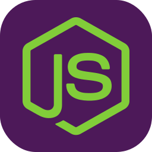

<h1 align="center">Hey! I'm Roderick</h1>

 
 &nbsp; &nbsp; 
 &nbsp; 

## I'm a Full Stack Developer, with experience in the **MERN** stack

 
 &nbsp; 
 &nbsp; 
 &nbsp; 
 &nbsp;

### Core Skills & Tools I frequently work with

 &nbsp; 
 &nbsp; 
 &nbsp;
 &nbsp;  
 &nbsp;
 &nbsp;

### Here are a few Tools/Skills I'm trying to learn

 &nbsp; 
  &nbsp; 
  &nbsp; 
  &nbsp; 
  &nbsp; 

