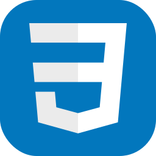

# Hey! I'm Roderick

## A Full Stack Developer, proficient in the **MERN** stack

 
 &nbsp; 
 &nbsp; 
 &nbsp; 
 &nbsp; 

### Additional Skills & Tools I frequently work with

 &nbsp; 
 &nbsp; 
 &nbsp;

 &nbsp;  

### Here are the Tools/Skills I'm currently invested in

 &nbsp; 
  &nbsp; 
  &nbsp; 

